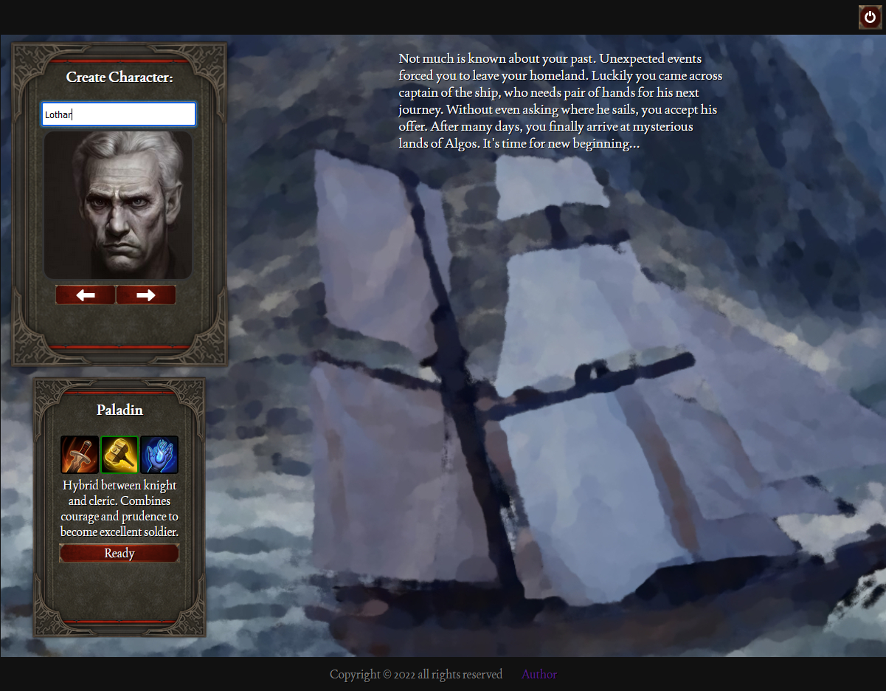
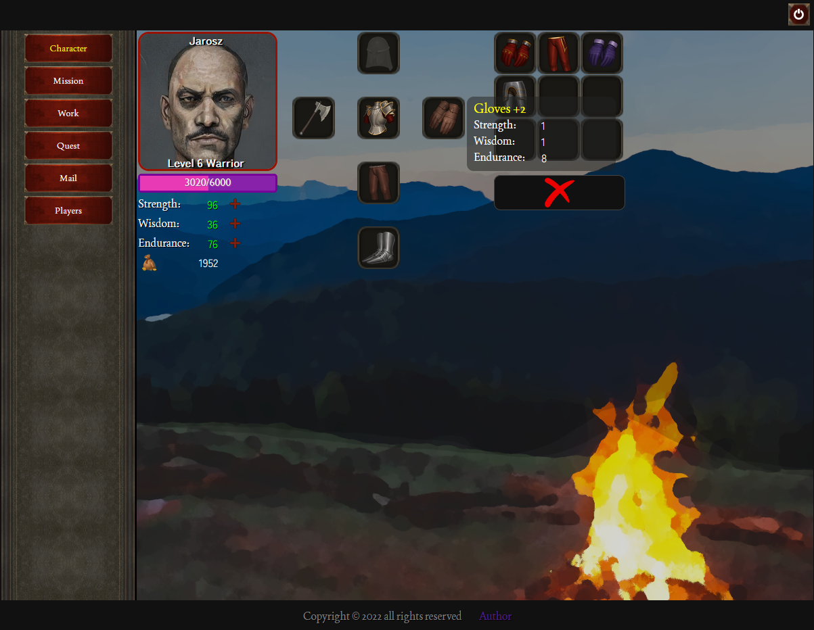
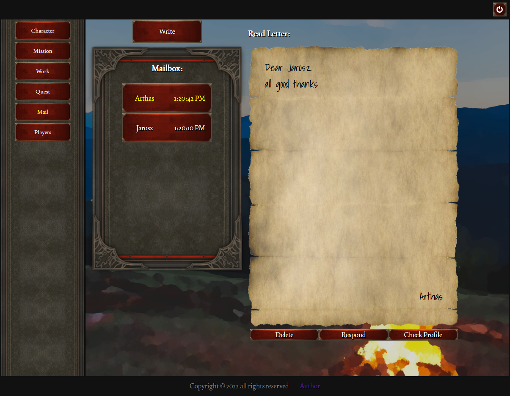

## Algos - browser game

https://algosbg.netlify.app/

### Description

Algos is browser game partially based on sfgame. It's made with React + Firebase. Main goal of game is to create character, upgrade skills, collect items and do tasks. Here's detailed list of functionalities:

- Login/Register with firebase auth
- Character creation with 3 different classes
- Character screen (upgrade skills, equip items)
- Mission screen (pick one of 3 random missions to gain reward)
- Work screen (set time to work and gain reward)
- Quest screen (fight monsters for better rewards) - unlocks at character level 3 - requires manual input of player (use different skills depending on class)
- Mail screen (send and receive letters from players)
- Players screen (check stats and items of other player)

Preview video:
https://www.youtube.com/watch?v=kqmUIguFIdg

Preview images:

Project made in React

#### `npm start`

Runs the app in the development mode.\
Open [http://localhost:3000](http://localhost:3000) to view it in your browser.

The page will reload when you make changes.\
You may also see any lint errors in the console.
